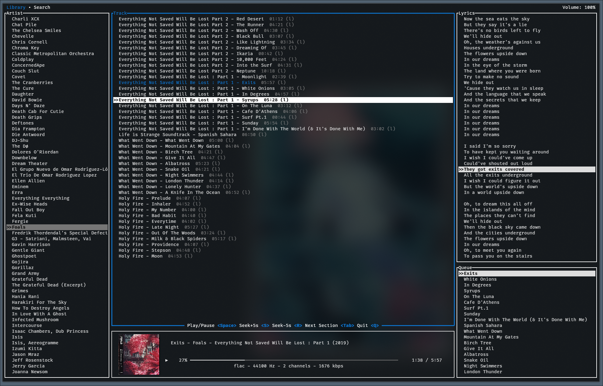

# jellyfin-tui

The goal of this project is a CMUS-like streaming client for Jellyfin with a featureful TUI.

Currently most of the basic features are implemented. I'm struggling with ratatui's wonky layout system. I'll see if I can get it to work properly, otherwise I'll switch to another tui library.

The player has a cover image in the corner, this requires the use of a terminal that supports sixel graphics. I will add a fallback for terminals that don't support it in the future. You can find out if your terminal supports sixel [here](https://www.arewesixelyet.com).

I'm enjoying the development of this project, so I'll continue to work on it. I'm open to suggestions and feature requests.




### Features
- streams your music from Jellyfin
- last.fm scrobbling
- vim keybindings
- sixel cover image
- lyrics (from jellyfin 10.9)
- queue

### Installation
Jellyfin-cli uses libmpv as the backend for audio playback. You need to have mpv installed on your system.

```bash
git clone https://github.com/dhonus/jellyfin-tui
cd jellyfin-tui
cargo run --release
```

### Configuration
When you run jellyfin-tui for the first time, it will ask you for the server address, username and password and save them in the configuration file.

The configuration file is located at `~/.config/jellyfin-tui/config.yaml`.
```yaml
server: "http://localhost:8096"
password: "password"
username: "username"
```

### Key bindings
|key / alt|action|
|---|---|
|space|play / pause|
|down / j|navigate down|
|up / k|navigate up|
|right / s|skip +5s|
|left / r|skip -5s|
|n|next track|
|p|previous track|
|tab|cycle between Artist & Track|
|shift + tab|focus Queue|
|q|quit|
