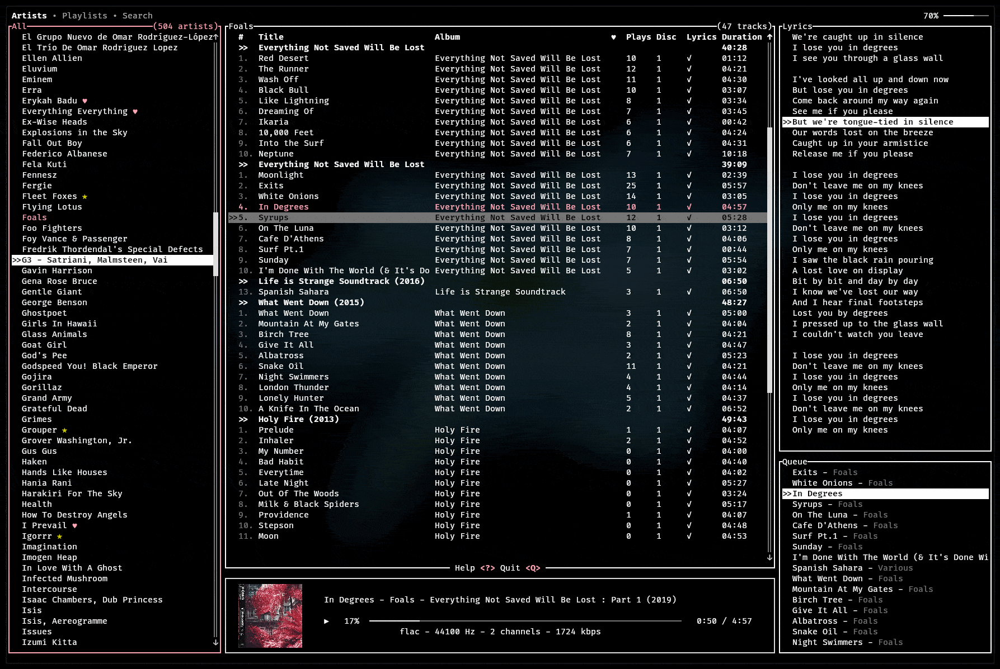
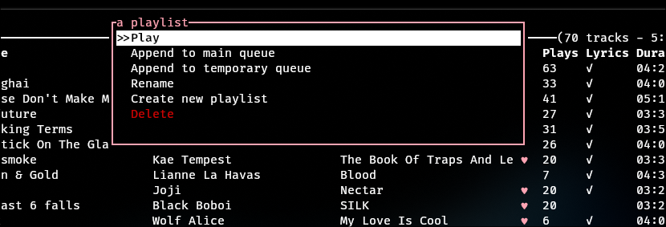
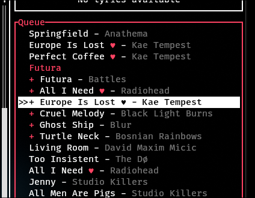

# jellyfin-tui

The goal of this project is a fully featured TUI client for Jellyfin. Inspired by CMUS and others, it's my attempt at creating a usable and feature-rich music player. The player has a cover image in the corner, courtesy of the [ratatui-image](https://github.com/benjajaja/ratatui-image) crate.

Most music players are either entirely terminal based but lack features and require a lot of work to setup; or are GUI based which I find to be slow and obtrusive to my workflow. I also wanted to utilize my jellyfin server as it's what I use for all my media.

### Features
- stream your music from Jellyfin
- lyrics with autoscroll (Jellyfin > 10.9)
- sixel **cover image**
- transcoding
- spotify-like double queue with order control, etc.
- last.fm scrobbling
- vim keybindings
- MPRIS controls
- playlists (play/create/edit)

### Planned features
- other media types (movies, tv shows)
- offline caching, jellyfin-wide remote control and much more
- if there is a feature you'd like to see, please open an issue :)

### Screenshots


### Installation
Jellyfin-tui uses libmpv as the backend for audio playback. You need to have mpv installed on your system.

#### Arch Linux
[jellyfin-tui](https://aur.archlinux.org/packages/jellyfin-tui/) is available as a package in the [AUR](https://aur.archlinux.org). You can install it with your preferred [AUR helper](https://wiki.archlinux.org/title/AUR_helpers). Example:
```bash
paru -S jellyfin-tui
```

#### Nix
[jellyfin-tui](https://search.nixos.org/packages?channel=unstable&show=jellyfin-tui&from=0&size=50&sort=relevance&type=packages&query=jellyfin-tui) is available as a package in [Nixpkgs](https://search.nixos.org/packages).

#### Other Linux
Linux is the main target OS for this project. You can install mpv from your package manager.
```bash
# add ~/.cargo/bin to your PATH (~/.bashrc etc.) if you haven't already
export PATH=$PATH:~/.cargo/bin/

# install mpv
sudo pacman -S mpv # arch
sudo apt install mpv libmpv-dev # ubuntu
```
```bash
# clone this repository
git clone https://github.com/dhonus/jellyfin-tui
cd jellyfin-tui

# checkout the latest stable version if desired
# (git pull and re-run to update)
git checkout $(git tag | tail -1)

cargo run --release

# or install
cargo install --path .
```

#### macOS
```bash
brew install mpv
git clone https://github.com/dhonus/jellyfin-tui
cd jellyfin-tui
export LIBRARY_PATH="$LIBRARY_PATH:$(brew --prefix)/lib"
export PATH=$PATH:~/.cargo/bin/
cargo install --path .
```
### Key bindings
Press **`?`** to see the key bindings at any time. Some of the most important ones are:

<details>
<summary>Key bindings</summary>
<br>

|key|alt|action|
|---|---|---|
|space||play / pause|
|enter||start playing selected|
|up / down|k / j|navigate **up** / **down**|
|tab||cycle between **Artist** & **Track** lists|
|shift + tab||cycle further to **Lyrics** & **Queue**|
|p||show **command prompt**|
|a / A||skip to next / previous **album**, or next in Artists, alphabetically|
|1,2,3,...|F1,F2,F3,...|switch tab >> F1 - **Library**, F2 - **Search**|
|F1|ESC|return to **Library** tab|
|left / right|r / s|seek +/- 5s|
|n||next track|
|N||previous track; if over 5s plays current track from the start|
|+ -||volume up / down|
|ctrl + e|ctrl + enter|play next|
|e|shift + enter|enqueue (play last)|
|E||clear queue|
|d||remove from queue|
|x||stop playback|
|X||reset the program|
|T||toggle transcode (applies to newly added songs, not whole queue)|
|q|^C|quit|

</details>

### Popup
There are only so many keys to bind, so some actions are hidden behind a popup. Press `p` to open it and `ESC` to close it. The popup is context sensitive and will show different options depending on where you are in the program.



### Queue
Jellyfin-tui has a double queue similar to Spotify. You can add songs to the queue by pressing `e` or `shift + enter`. Learn more about what you can do with the queue by pressing `?` and reading through the key bindings.



### Configuration
When you run jellyfin-tui for the first time, it will ask you for the server address, username and password and save them in the configuration file.

The program **prints the config location** when run. On linux, the configuration file is located at `~/.config/jellyfin-tui/config.yaml`. Feel free to edit it manually if needed.
```yaml
#= Must contain protocol and port
server: 'http://localhost:8096'
username: 'username'
password: 'imcool123'

# All following settings are OPTIONAL. What you see here are the defaults.

# Show album cover image
art: true
# Save and restore the state of the player (queue, volume, etc.)
persist: true
# Grab the primary color from the cover image (false => uses `primary_color` instead)
auto_color: true
# Hex or color name ('green', 'yellow' etc.). If not specified => blue is used.
primary_color: '#7db757'

# Requests a transcoded stream from jellyfin. Bitrate in kbps. Container is optional.
# enabled = default value at startup
transcoding:
  enabled: false
  bitrate: 320
  # container: mp3

# Options specified here will be passed to mpv - https://mpv.io/manual/master/#options
mpv:
  af: lavfi=[loudnorm=I=-16:TP=-3:LRA=4]
  no-config: true
  log-file: /tmp/mpv.log
```

### MPRIS
Jellyfin-tui registers itself as an MPRIS client, so you can control it with any MPRIS controller. For example, `playerctl`.

### Search

In the Artists and Tracks lists you can search by pressing `/` and typing your query. The search is case insensitive and will filter the results as you type. Pressing `ESC` will clear the search and keep the current item selected.

You can search globally by switching to the Search tab. The search is case insensitive and will search for artists, albums and tracks. It will pull **everything** without pagination, so it may take a while to load if you have a large library. This was done because jellyfin won't allow me to search for tracks without an artist or album assigned, which this client doesn't support.


### Recommendations
- **cover image**: make sure you download 1:1 images to use as cover art
- **lyrics**: jellyfin-tui will show lyrics if they are available in jellyfin. To use autoscroll they need to contain timestamps. I recommend using [LRCGET](https://github.com/tranxuanthang/lrcget) by tranxuanthang. If you value their work, consider donating to keep the amazing free service running.

### Known issues
Due to the nature of the project and jellyfin itself, there are some limitations and issues:
- jellyfin-tui assumes you correctly tag your music files. Please look at the [jellyfin documentation](https://jellyfin.org/docs/general/server/media/music/) on how to tag your music files. Before assuming the program is broken, verify that they show up correctly in Jellyfin itself.
- if your **cover image** has a black area at the bottom, it is because it's not a perfect square. Please crop your images to a square aspect ratio for the best results.

### Supported terminals
Not all terminals have the features needed to cover every aspect of jellyfin-tui. While rare, some terminals lack sixel (or equivalent), such as  image support or have certain key event limitations. The following are tested and work well:
- kitty (recommended)
- iTerm2 (recommended)
- ghostty
- wezterm
- konsole

The following have issues
- alacritty, gnome console, terminator (no sixel support and occasional strange behavior)
